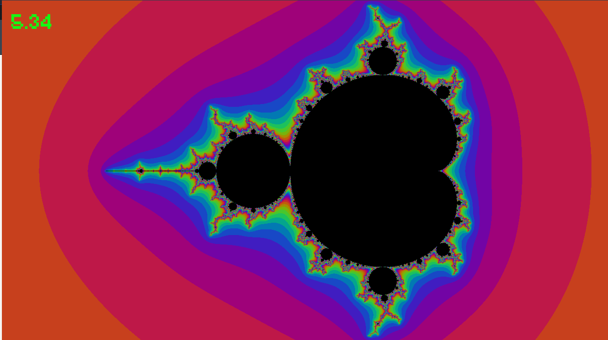
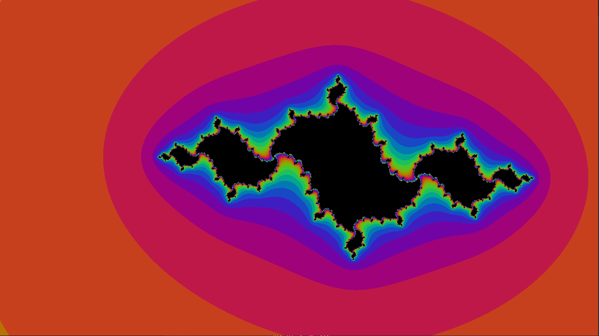

# Mandelbrot set

This project is dedicated to optimizing the construction of the Mandelbrot set. 

[]

I used the sfml library to draw the Mandelbrot set.

## Optimizations
I took a standard [algorithm](https://en.wikipedia.org/wiki/Mandelbrot_set) (and the simplest one) for constructing the Mandelbrot set. 

Then, to simplify the calculation, it were vectorized. First in arrays (4 pixels), then 4 pixels each (128-bit registers, SSE instuctions), and then 8 pixels each (256-bit registers, AVX instructions). The tests were carried out at the standard location of the camera

Here are the test results obtained:

| Optimization | Checks | FPS  | Checks | FPS  |
| -----------: | -----: | :-:  | -----: | :-:  |
|    no        | 10000  | 0.27 |  1000  | 2.06 |
| arrays       | 10000  | 0.22 |  1000  | 1.92 |
|   128-bit    | 10000  | 0.80 |  1000  | 6.05 |
|   256-bit    | 10000  | 1.45 |  1000  | 8.91 |

The results generally satisfy the theoretical.

All implementations can be found by the corresponding commit.

# Control

If you want to run this program at your pc, you will need to know the control of this program.

* Escape - stop/start drawing (a black screen means that the program does not draw)

* F - on/of fps counter

* \+ - zoom in

* \- - zoom out

* arrows (← → ↑ ↓) - moving the camera

# Julia set

You can also draw a Julia set. See the corresponding branch.

Additional control: 

* S - pause (stop/start dynamic phase increase)

.png)

